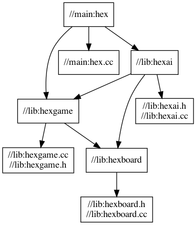

# Hexgame

## Setup
### Bazel
* `Bazel version`: bazel 3.7.2-homebrew
* Bazel [setup](https://docs.bazel.build/versions/master/install.html)
* Bazel [C++](https://docs.bazel.build/versions/master/tutorial/cpp.html)

### GTest
* `GTest version`: @tag `v1.10.x`
* Include GTest as external lib in `WORKSPACE` file
* Used as `deps` in `//test` package

## Commands
* Build: `bazel build //main:hex`
* Run: `bazel build //main:hex` or run `./bazel-bin/main/hex`
* Build GTest lib: `bazel build //test:hello_test`
* Run a test: `bazel run //test:hello_test`

## Program does
1. Draw the board using ASCII symbols and a given size, such as 7 by 7 or 11 by 11
2. Input a move and determine if a move is legal.
3. Computer opponent move based on Monte Carlo simulation
4. Determine who won.

## Deps graph
* Install dot command line tool with GraphViz: `brew install graphviz`
* dot version: `dot -V` - dot - graphviz version 2.44.1 (20200629.0846)
* Deps Graph: `bazel query --notool_deps --noimplicit_deps "deps(//main:hex)" --output graph`
* Export graph: `bazel query --notool_deps --noimplicit_deps "deps(//main:hex)" --output graph | dot -Tpng > assets/images/deps.png`

## Reference
* [Hex Game](https://en.wikipedia.org/wiki/Hex_(board_game))
* [Bazel docs](https://docs.bazel.build/versions/master/bazel-overview.html)
* [GraphViz](https://graphviz.org/documentation/)
* [WebGraphVizTool](http://www.webgraphviz.com/)
* [Google Test](https://github.com/google/googletest)
* [Google C++ Style Guide](https://google.github.io/styleguide/cppguide.html)